Picture this: you've built a slick AI workflow. A user sends a prompt, and your LLM starts generating tokens. But nothing shows up in the UI. Fifteen seconds pass. Still nothing. The vision model downstream is holding everything hostage while it loads into VRAM. Finally, the entire response dumps out at once. Your users think your app is broken.

We've been there. A lot. And that's exactly why we built NodeTool's streaming architecture the way we did.

If you're building AI workflow engines, agent orchestrators, or anything that chains LLMs with tools and models—this is how we solved the "everything blocks everything" problem.

## The Pain: Traditional DAG Execution

Most workflow engines think in terms of "topological waves." Complete node A, then start node B, then start node C:

```
Traditional: Node A completes → Node B starts → Node C starts
Problem: Long-running nodes block everything downstream
```

For typical data pipelines, that's fine. But for AI workloads—LLM streaming, image generation, audio synthesis—it's a disaster. Users stare at a blank screen while models churn in the background. In one of our early prototypes, a single Stable Diffusion node would freeze the entire graph for 30+ seconds. Not great.

## Our Solution: Actor-Based Streaming

The core insight: **treat everything as a stream**. A scalar value? That's just a stream of length 1. This sounds obvious, but most orchestrators don't do it.

Once you commit to this model, a lot of nice things fall out:

- **Token-by-token LLM output** flows through the graph as it's generated
- **Progressive image generation** can show intermediate steps
- **Audio processing** happens with minimal perceived latency
- **Backpressure** keeps your memory usage sane

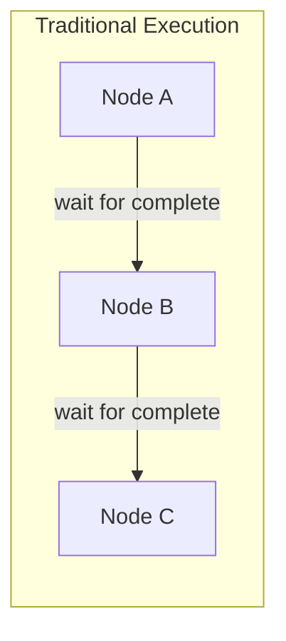

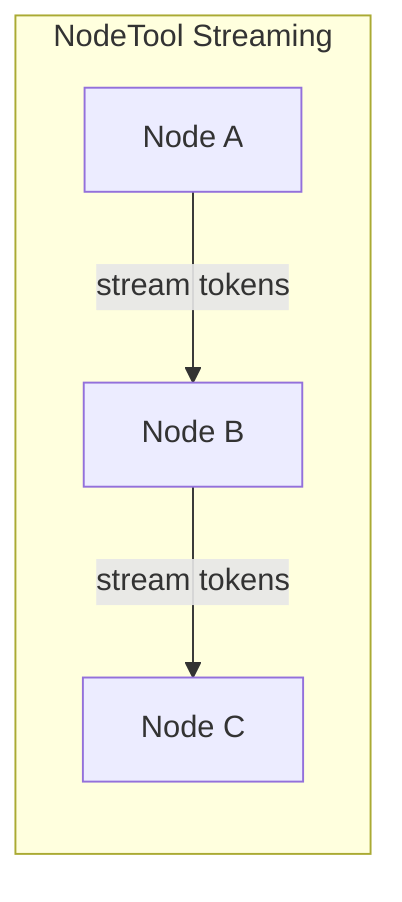

## Core Architecture

### One Actor Per Node

We deliberately avoided a global scheduler that decides execution waves. That approach makes streaming semantics much harder to reason about—when does a "wave" end if some nodes are yielding tokens indefinitely?

Instead, each node runs in its own async task (we call it a `NodeActor`). They wake up when they have input, process it, and emit output. No coordinator bottleneck, no blocking waits:

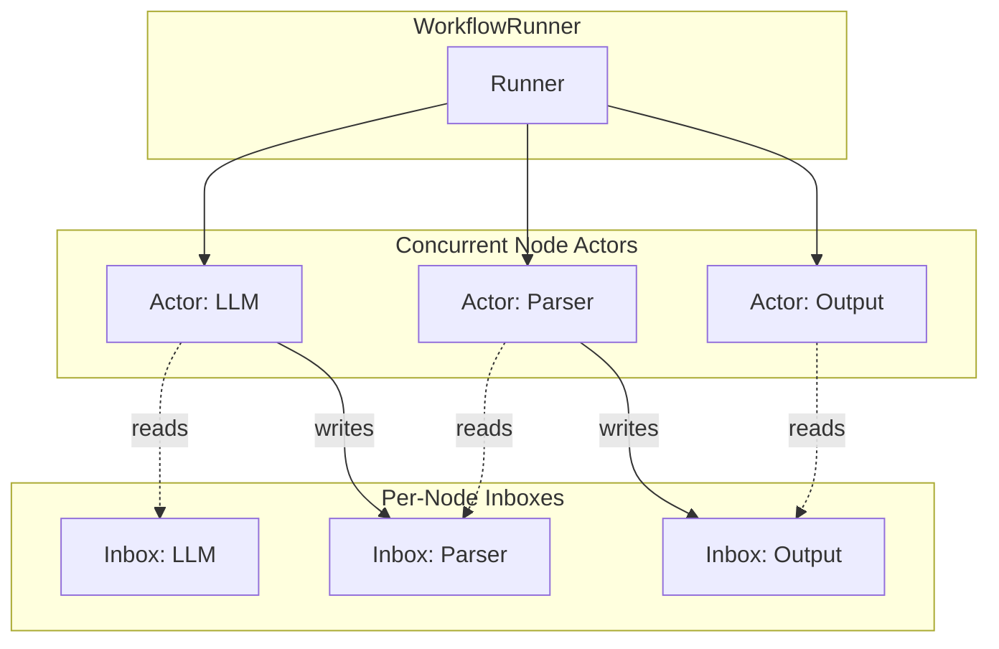

There's a trade-off here worth mentioning: the actor-per-node model does add some overhead for tiny graphs with simple nodes. But it pays off quickly once you have any long-running or streaming nodes—which, in AI workflows, is basically always.

### NodeInbox: Per-Handle FIFO Buffers

Each node gets an inbox with per-handle buffers. The API is dead simple—producers write, consumers iterate:

```python
# Producer (upstream node)
await inbox.put("prompt", "Hello, world!")

# Consumer (node's run method)
async for item in inputs.stream("prompt"):
    process(item)
```

We spent a lot of time getting these details right:
- **Per-handle FIFO ordering**: messages on a given input arrive in the order they were sent
- **Backpressure**: configurable buffer limits prevent runaway memory usage
- **EOS tracking**: explicit end-of-stream signals prevent downstream hangs

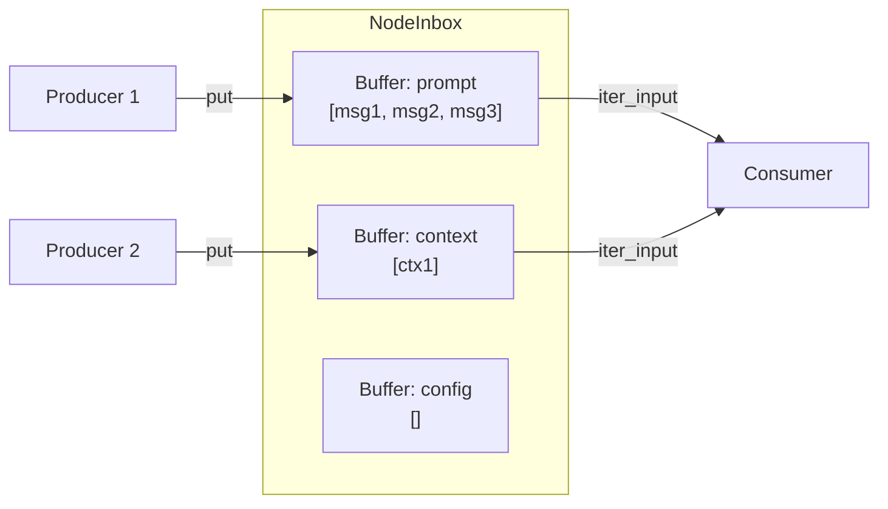

### Three Ways Nodes Can Stream

Nodes declare their streaming behavior with two simple flags. Here's what each combination means in practice:

| `is_streaming_input` | `is_streaming_output` | What It Does |
|---------------------|----------------------|----------|
| `False` | `False` | **Buffered**: Collects inputs, calls `process()` once with everything ready |
| `False` | `True` | **Streaming Producer**: Batches inputs, then yields outputs via `gen_process()` |
| `True` | `True` | **Full Streaming**: Node controls its own input iteration—maximum flexibility |

```python
# Buffered node - straightforward, process() gets called once
class SumNode(BaseNode):
    async def process(self, context):
        return {"output": self.a + self.b}

# Streaming producer - perfect for LLMs that yield tokens
class LLMNode(BaseNode):
    @classmethod
    def is_streaming_output(cls) -> bool:
        return True
    
    async def gen_process(self, context):
        async for token in self.llm.stream(self.prompt):
            yield ("output", token)

# Full streaming - you control when and how to consume inputs
class StreamProcessor(BaseNode):
    @classmethod
    def is_streaming_input(cls) -> bool:
        return True
    
    @classmethod
    def is_streaming_output(cls) -> bool:
        return True
    
    async def run(self, context, inputs, outputs):
        async for handle, item in inputs.iter_any():
            result = transform(item)
            await outputs.emit("output", result)
```

## How Data Actually Flows

### Message Routing

When a node emits output, our `WorkflowRunner` routes it to every connected downstream inbox. No polling, no coordination overhead—just direct writes with async notification:

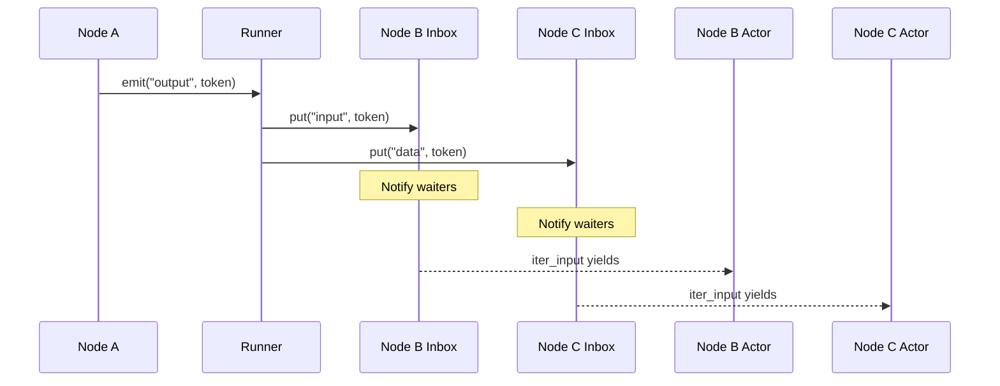

### Backpressure That Actually Works

Here's a scenario we hit constantly in real workflows: an LLM streams out ~50 tokens/sec, but a downstream GPU node can only process 5 items/sec. Without backpressure, you're looking at memory climbing to hundreds of megabytes of buffered tokens within seconds. Not great when you're running multiple concurrent workflows.

Our solution: configurable `buffer_limit` per inbox. When a buffer fills up, the producer's `put()` call blocks until space opens up. Buffers stay bounded at N items, no matter how fast the producer runs.

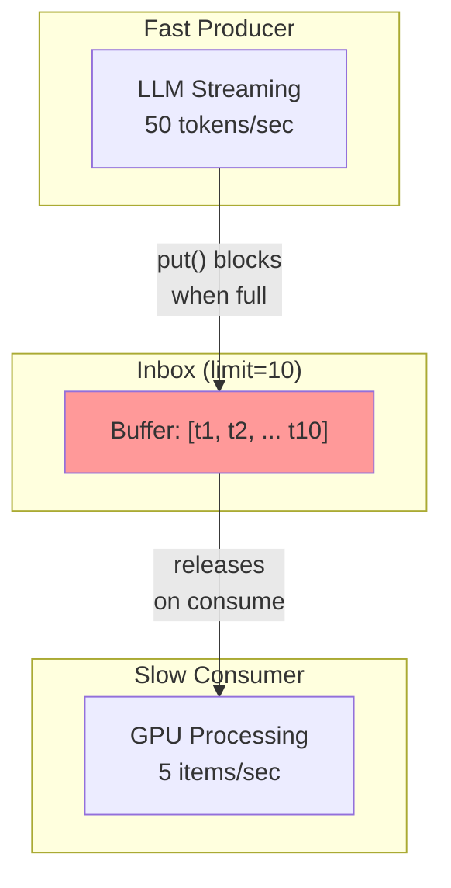

The mechanics:
1. Producer's `put()` awaits on a condition variable when the buffer is full
2. Consumer pops an item and signals the condition
3. Producer resumes

In practice, this means your fast producers can't blow up memory just because a GPU node is slow.

### End-of-Stream: Preventing the Infinite Hang

Early on, we ran into a nasty bug class: parser nodes would hang forever if an upstream LLM crashed mid-response. The consumer was waiting for more tokens that would never arrive.

The fix: explicit EOS (end-of-stream) tracking per handle. Every producer registers itself, and every producer must signal when it's done:

```python
# Track upstream sources
inbox.add_upstream("prompt", count=2)  # Two producers will send to this handle

# Each producer signals completion
inbox.mark_source_done("prompt")  # Decrements the count

# Consumer iteration terminates cleanly when count hits 0 and buffer empties
async for item in inbox.iter_input("prompt"):
    process(item)
# No more infinite hangs waiting for ghosts
```

## Input Synchronization: `on_any` vs `zip_all`

When a node has multiple inputs, you need a policy for when to fire. We provide two modes via `sync_mode`, and picking the right one matters more than you'd think.

### `on_any` (Default)

Fire immediately on any arrival, using the latest value from other handles:

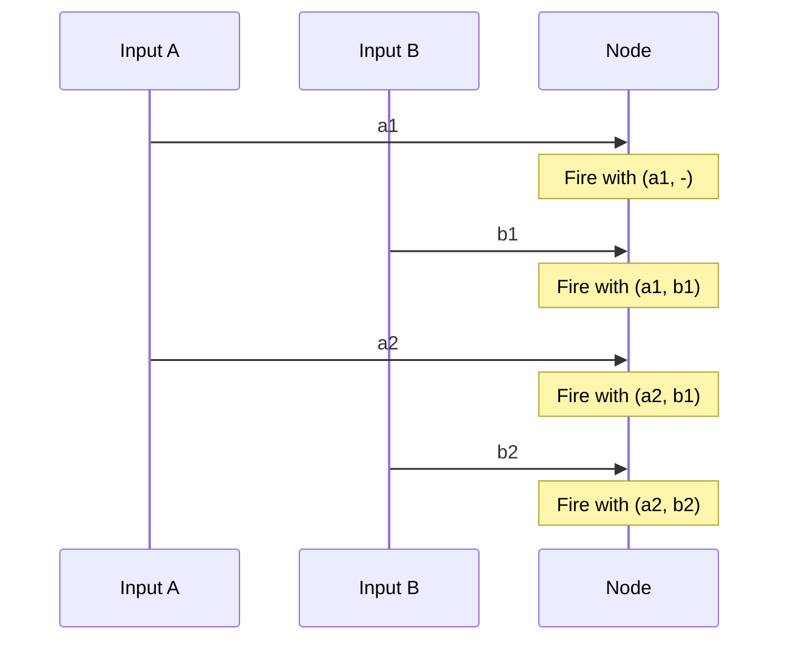

Good for: reactive nodes that should respond to any change, control signals mixed with data streams, UI-bound nodes that need to show progress.

### `zip_all`

Wait for exactly one item per handle, consume in lockstep:

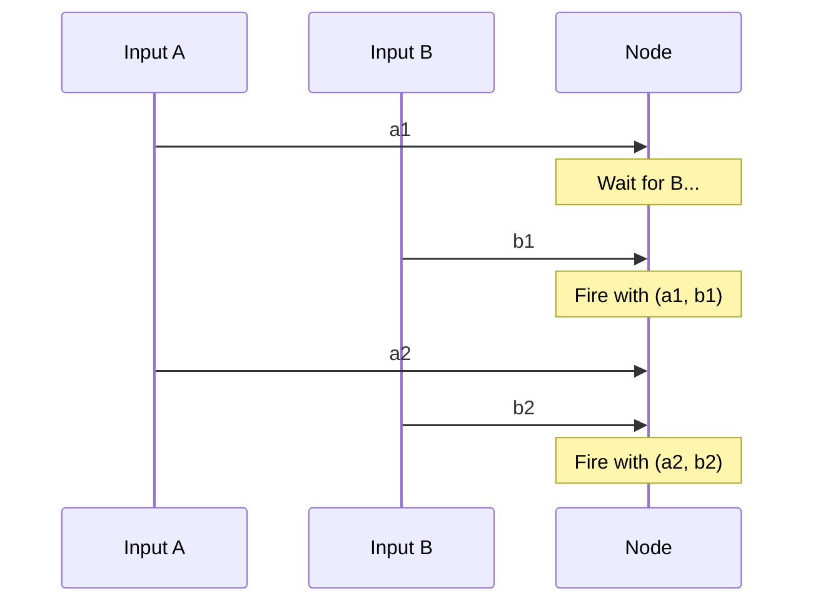

Good for: batch processing where inputs must be paired, operations that require synchronized data (like zipping audio and video frames).

## GPU Coordination: The Global Lock

Here's a war story: in an early version of NodeTool, we'd sometimes get CUDA errors or outright OOMs when two nodes tried to load models simultaneously. Stable Diffusion loading while an LLM was mid-inference? Crash. Two image models fighting for VRAM? Crash.

Our solution is simple but effective: a global async lock that serializes GPU access.

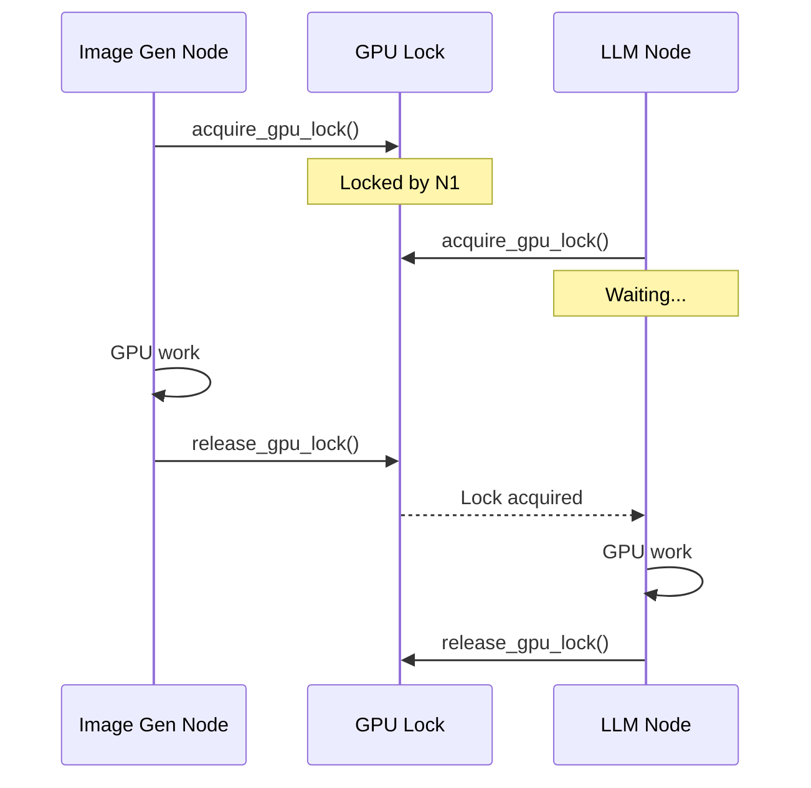

The key details:
- **Non-blocking wait**: we use `asyncio.Condition`, so the event loop stays responsive while waiting
- **Timeout protection**: 5-minute timeout with holder tracking for debugging stuck nodes
- **VRAM cleanup**: we automatically free cached memory before GPU operations

After adding this, our crash rate from concurrent model loads dropped to essentially zero. The throughput cost is real—you can't parallelize GPU work—but for most AI workflows, the bottleneck is the model inference anyway, not the scheduling.

## Real-Time UI Updates

Because nodes emit updates as they work (not just when they finish), we can push those to the client in real-time:

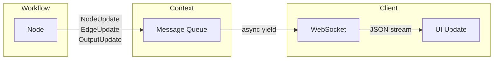

The update types we emit:
- `NodeUpdate`: status changes (running, completed, error)
- `EdgeUpdate`: message counts, whether an edge has drained
- `OutputUpdate`: final values from output nodes
- `JobUpdate`: workflow-level status

This is what makes the difference between "staring at a spinner" and "watching your AI think in real-time."

## Cross-Graph Coordination with Channels

Sometimes you need coordination that doesn't fit the graph topology. Maybe you want to broadcast progress updates, or have a central control node that can signal others to stop. That's what `ChannelManager` is for:

```python
# Publish from anywhere
await context.channels.publish("progress", {"step": 3, "total": 10})

# Subscribe from another node (or external consumer)
async for msg in context.channels.subscribe("progress", "my-subscriber"):
    update_ui(msg)
```

Each subscriber gets their own queue, so they can consume at their own pace without affecting others. We use this internally for things like cancellation signals and cross-workflow coordination.

## Why This Matters for AI Workflows

Let's make it concrete with a few patterns we use constantly.

### Token Streaming

LLM responses flow token-by-token through the entire graph. Your JSON parser starts working before the LLM is done, and your tool handler can react immediately:

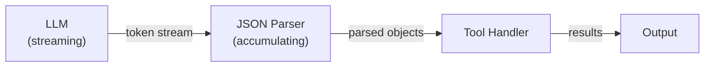

### Agentic Workflows

Agents with tool use can take minutes to complete. With streaming, users see thoughts, tool calls, and intermediate results as they happen:

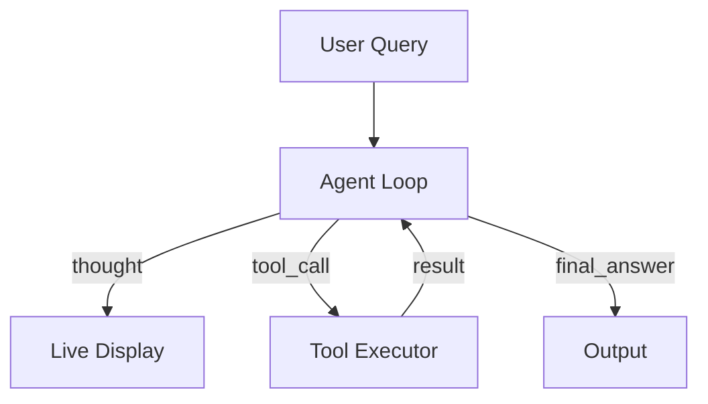

### Multi-Modal Pipelines

Image generation, TTS, and text can all process in parallel. The GPU lock ensures they don't fight over VRAM, but they don't block each other from starting:

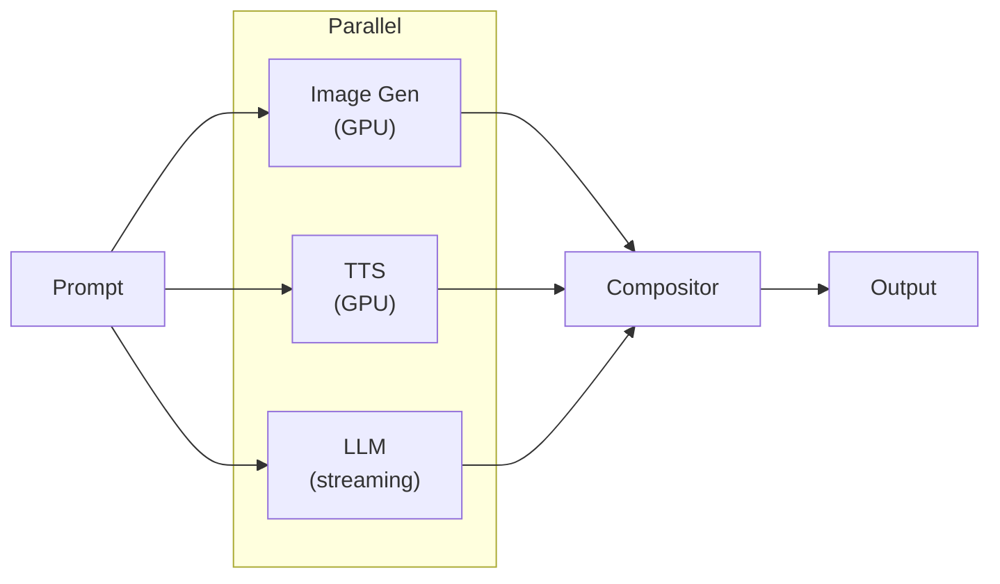

## Building Nodes: A Quick Guide

If you're writing custom nodes for NodeTool, here's how to think about the streaming flags:

**Building a streaming LLM tool node?**
- Set `is_streaming_output = True`
- Implement `gen_process()` and yield tokens on your output handle
- Use `on_any` sync mode if you need to react to control messages mid-stream

**Building a node that processes a stream of items?**
- Set both `is_streaming_input = True` and `is_streaming_output = True`
- Implement `run()` and use `inputs.iter_any()` or `inputs.iter_input("handle")`
- Emit results as you process with `outputs.emit()`

**Building a simple transform node?**
- Leave both flags `False` (the default)
- Implement `process()` and return your output dict
- The framework handles batching and buffering for you

## Diving Into the Code

If you want to explore the implementation, here's where to start:

| File | What You'll Find |
|------|---------|
| `workflow_runner.py` | The main orchestrator—graph execution, inbox management, message routing |
| `actor.py` | Per-node execution logic, handles streaming vs buffered dispatch |
| `inbox.py` | The FIFO buffers with backpressure and EOS tracking |
| `io.py` | `NodeInputs`/`NodeOutputs`—the API node authors actually use |
| `channel.py` | Named broadcast channels for out-of-band coordination |
| `run_workflow.py` | High-level async interface if you want to embed NodeTool |

## Wrapping Up

Building responsive AI applications means rethinking how workflow engines work. The traditional "run each node to completion" model just doesn't cut it when you're dealing with streaming LLMs, long-running GPU operations, and users who expect instant feedback.

Our actor-per-node architecture with streaming-first semantics gives us:

1. **Instant responsiveness**: tokens flow as they're generated, not after everything finishes
2. **Bounded memory**: backpressure keeps buffers from exploding
3. **GPU sanity**: serialized access without blocking the event loop
4. **Real-time UI**: updates push to clients as work progresses
5. **Flexible input handling**: `on_any` and `zip_all` cover most synchronization needs

The result: AI workflows that feel instant, even when the underlying work takes time.

---

*Want to try it yourself? Check out [NodeTool on GitHub](https://github.com/nodetool-ai/nodetool) or join our [Discord](https://discord.gg/nodetool) to chat with the team.*
